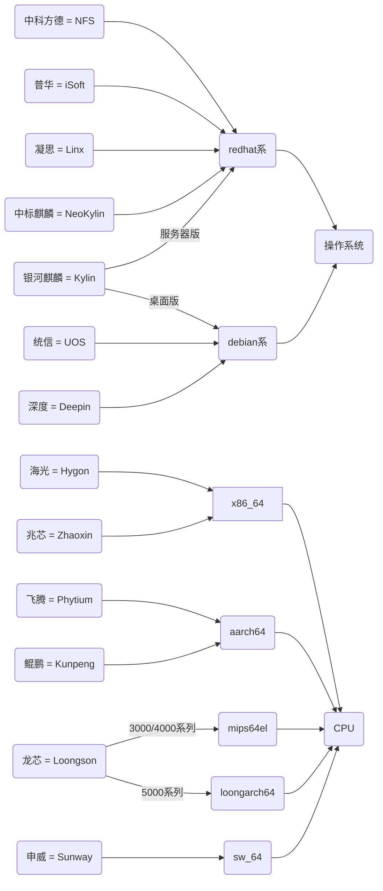

国产 `操作系统` 和 `CPU` 厂商数量繁多，令人眼花缭乱，如果你做一款 C/C++ 软件需要适配国产的各种操作系统和 CPU，打包时针对每一种操作系统和 CPU 的组合都要打一个包的话，那么每一次打包的数量可能会多达数十个，光是编译环境的准备都需要耗费大量的时间，这无疑是令人难以接受的。

但是万变不离其宗，如果经过仔细分析的话，会发现这些操作系统和 CPU 都是从现有的体系中衍生出来的，而不是完全新生事物，比如操作系统都是基于 `Linux` 的，且按照系统自带的包管理软件的不同，可以分为 `2` 个系列，分别是使用 `rpm` 的 `redhat 系` 和使用 `dpkg` 的 `debian 系`，适用于它们的安装包格式分别是 `rpm` 和 `deb`。CPU 按照指令架构划分，则可以分为 `x86_64`、`aarch64`、`mips64el`、`loongarch64`、`sw_64` 这 `5` 类，由于叫法的不同，有的会把 x86_64 叫做 `amd64`，把 aarch64 叫做 `arm64`，其实本质上它们是一样的。

按照以上这样划分，再结合我的另一篇文章《[一种让 Linux 上的 C/C++ 程序自带依赖库的打包方式](https://blog.zhaowcheng.com/posts/a-packaging-method-with-its-own-deps/)》中介绍的打包方法，打包工作就可以得到极大的简化，最终就变成了每次只需要打 `2 * 5 = 10` 个包就可以适配所有的操作系统和 CPU。

以下是我个人接触过的国产操作系统和 CPU 分类：

