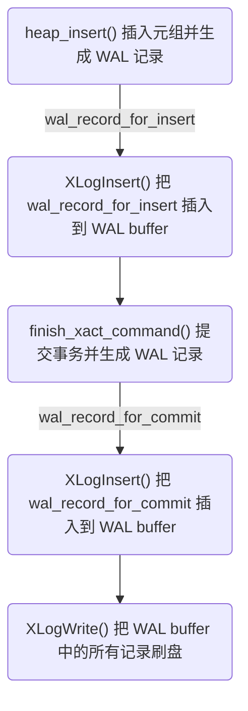

## 1 简介

PostgreSQL 以页（page，默认 8KB）为单位对数据文件进行访问，为了提高访问的效率，会先把需要访问的页从磁盘加载到共享缓冲区（shared_buffers，内存）再进行操作，然后由后台写入进程（bgwriter）定期把缓冲区中的脏页（被修改过的）写入磁盘。由此带来一个问题，就是当发生数据库故障、操作系统故障、电源故障等情况时，缓冲区中还未来得及写入磁盘的数据会丢失。

为了解决这个问题，在早期的版本（7.1 以前）中，当缓冲区中的页发生修改时，会同步写入磁盘，但是这样又带来一个新的问题，就是数据库的写性能很差。然后从 `7.1` 开始引入了 WAL（Write-Ahead Logging: 预写式日志）机制。WAL 的基本原理是，对每次写操作都生成一个 WAL 记录（record），记录了具体的操作以及写入的数据，在事务提交时把这些 WAL 记录写入到磁盘，当发生故障后重新启动数据库时会从磁盘读取这些 WAL 记录并回放（replay）来恢复因故障导致丢失的缓冲区中的页。

由于 WAL 仅记录了修改的数据（如插入的 tuple），相比以页为单位写入磁盘更轻量，而且 WAL 记录写入磁盘时只需顺序写入，相比位置分散的页，在写入效率上要高得多，因此 WAL 机制既避免了数据丢失的风险，同时又不影响数据库的性能。

## 2 存储结构

### 2.1 逻辑文件结构

假设把所有 WAL 数据都存储到一个文件中，用偏移量表示某个数据在这个文件中的起始位置，那么 `LSN`（log sequence number: 日志序列号）就是这个偏移量。由于代码中 LSN 用 64 位无符号整数表示，所以这个 WAL 文件理论上大小为 `2^64=16EB(ExaBytes)`，但是实际上我们不可能读写这么大一个文件，所以 PostgreSQL 把 WAL 文件分割为多个 `段文件（segment file）`，默认段大小为 `16MB`（从 `PG11` 开始，可以在 initdb 时通过参数 `--wal-segsize` 指定段大小，但是必须是 1~1024 之间的 2 的整数倍，如 1MB, 2MB, 4MB, 8MB, ...）。

WAL 段文件名使用 24 位 16 进制表示，前 8 位表示时间线，中间 8 位 + 末尾 2 位表示段文件编号（以 16MB 段大小为例），示例图如下：


### 2.2 段文件结构

WAL 段文件内部分为多个 `8KB` 大小的 `页（page）`，每个页开头为头部数据，后续才是 `WAL 记录（record）`，第一个页的头部使用数据结构 [XLogLongPageHeaderData](https://github.com/postgres/postgres/blob/REL_18_1/src/include/access/xlog_internal.h#L61) 表示，其他页头部使用数据结构 [XLogPageHeaderData](https://github.com/postgres/postgres/blob/REL_18_1/src/include/access/xlog_internal.h#L36) 表示。


### 2.3 记录结构

一条 WAL 记录可分为 `头部` 和 `数据部分`，头部长度固定，数据部分不固定，通过头部中的信息获取数据部分的长度。

#### 2.3.1 记录头部

WAL 记录头部使用数据结构 [XLogRecord](https://github.com/postgres/postgres/blob/REL_18_1/src/include/access/xlogrecord.h#L41) 表示，其定义如下：

```c
typedef struct XLogRecord
{
	uint32		xl_tot_len;		/* total len of entire record */
	TransactionId xl_xid;		/* xact id */
	XLogRecPtr	xl_prev;		/* ptr to previous record in log */
	uint8		xl_info;		/* flag bits, see below */
	RmgrId		xl_rmid;		/* resource manager for this record */
	/* 2 bytes of padding here, initialize to zero */
	pg_crc32c	xl_crc;			/* CRC for this record */

	/* XLogRecordBlockHeaders and XLogRecordDataHeader follow, no padding */

} XLogRecord;
```

其中 `xl_rmid` 和 `xl_info` 用来在回放时确定具体的动作，以下面几个典型场景来举例说明其作用：

- 当执行 `插入（INSERT）` 语句时生成的 WAL 记录的 xl_rmid 和 xl_info 分别为 `RM_HEAP` 和 `XLOG_HEAP_INSERT`，当回放该 WAL 记录时就会调用 `heap_xlog_insert()` 函数来插入数据。
- 当执行 `更新（UPDATE)` 语句时生成的 WAL 记录的 xl_rmid 和 xl_info 分别为 `RM_HEAP` 和 `XLOG_HEAP_UPDATE`，当回放该 WAL 记录时就会调用 `heap_xlog_update()` 函数来更新数据。
- 当执行 `提交（COMMIT）` 语句时生成的 WAL 记录的 xl_rmid 和 xl_info 分别为 `RM_XACT` 和 `XLOG_XACT_COMMIT`，当回放该 WAL 记录时就会调用 `xact_redo_commit()` 函数来提交数据。

#### 2.3.2 记录数据

WAL 记录的数据部分可分为 3 类：`备份块（Backup Block）`、`非备份块（Non-Backup Block）` 和 `检查点（Checkpoint）`。

关于备份块，请查看 [全页写](#32-全页写) 说明。


1. **备份块数据结构**：
  - [XLogRecord](https://github.com/postgres/postgres/blob/REL_18_1/src/include/access/xlogrecord.h#L41): 通用 WAL 记录头部。
  - [XLogRecordBlockHeader](https://github.com/postgres/postgres/blob/REL_18_1/src/include/access/xlogrecord.h#L103): 数据页信息，包括 `relfilenode`、`fork number` 和 `block number`，由于是备份块，同时还包括 [XLogRecordBlockImageHeader](https://github.com/postgres/postgres/blob/REL_18_1/src/include/access/xlogrecord.h#L141)，该结构保存着数据页的长度和是否压缩等信息。
  - [XLogRecordDataHeaderShort](https://github.com/postgres/postgres/blob/REL_18_1/src/include/access/xlogrecord.h#L213): WAL 记录主数据 `xl_heap_insert` 的长度信息。
  - block data1: 完整的数据页。
  - [xl_heap_insert](https://github.com/postgres/postgres/blob/REL_18_1/src/include/access/heapam_xlog.h#L160): 在备份块中，该部分通常没有用。

2. **非备份块数据结构**：
  - [XLogRecord](https://github.com/postgres/postgres/blob/REL_18_1/src/include/access/xlogrecord.h#L41): 通用 WAL 记录头部。
  - [XLogRecordBlockHeader](https://github.com/postgres/postgres/blob/REL_18_1/src/include/access/xlogrecord.h#L103): 数据页位置信息，包括 `relfilenode`、`fork number` 和 `block number`。
  - [XLogRecordDataHeaderShort](https://github.com/postgres/postgres/blob/REL_18_1/src/include/access/xlogrecord.h#L213): WAL 记录主数据 `xl_heap_insert` 的长度信息。
  - block data1: 插入的元组（tuple）。
  - [xl_heap_insert](https://github.com/postgres/postgres/blob/REL_18_1/src/include/access/heapam_xlog.h#L160): 元组（tuple）插入到数据页中的偏移量等信息。

3. **检查点数据结构**：
  - [XLogRecord](https://github.com/postgres/postgres/blob/REL_18_1/src/include/access/xlogrecord.h#L41): 通用 WAL 记录头部。
  - [XLogRecordDataHeaderShort](https://github.com/postgres/postgres/blob/REL_18_1/src/include/access/xlogrecord.h#L213): WAL 记录主数据 `CheckPoint` 的长度信息。
  - [CheckPoint](https://github.com/postgres/postgres/blob/REL_18_1/src/include/catalog/pg_control.h#L35): 检查点信息。

## 3 基本原理

### 3.1 检查点

检查点（Checkpoint）是指由 `检查点进程` 执行的一个过程，该过程主要目的有两个：一是保存数据库恢复所需的信息；二是把共享缓冲区的脏页刷盘。

#### 3.1.1 触发时机

检查点在以下时机会触发：

1. 数据库配置参数 `checkpoint_timeout` 配置的周期性间隔时间到了，默认为 `300s`。
2. `pg_wal` 目录中的 wal 段文件总大小达到了数据库配置参数 `max_wal_size` 配置的大小时，默认为 `1GB`。
3. 数据库以 `smart` 或 `fast` 模式关闭时。
4. 数据库管理员手动执行 `CHECKPOINT` 命令时。

#### 3.1.2 具体过程


1. 检查点过程开始时，先获取 `重做点（REDO point）`，也就是当前 WAL 文件的下一个可用位置（文件末尾 LSN + 1），这个位置将作为数据库恢复（WAL 回放）的起点，因为检查点一旦完成，REDO 之前的 WAL 记录对应的数据脏页肯定都已经刷盘了，那么这些 WAL 记录都不需要回放了，只有 REDO 之后的 WAL 记录才可能需要回放。

2. 把共享缓冲区中的一些重要数据（比如 CLOG(Commit Log)）都刷盘。

3. 把共享缓冲区中的脏页逐一刷盘。

4. 生成并写入一个包含 [CheckPoint](https://github.com/postgres/postgres/blob/REL_18_1/src/include/catalog/pg_control.h#L35) 数据结构的 WAL 记录，这个数据结构中就包含了第 1 步获取的 REDO 位置。

5. 更新 `pg_control` 文件，该文件中记录了很多重要信息，其中就包括最近一次检查点 WAL 记录的位置，数据库恢复时将从该文件中获取检查点 WAL 记录位置，然后再从检查点 WAL 记录中获取 REDO 位置。

#### 3.1.3 pg_control 文件

pg_control 文件是存储在数据库 data 目录的 `global` 子目录下的一个重要文件，其中保存了很多用于数据库恢复的信息，如果该文件损坏，数据库恢复将无法进行。

可通过 `pg_controldata` 命令查询该文件中的信息：

```console
$ pg_controldata -D /usr/local/pgsql/data
pg_control version number:            1700
Catalog version number:               202406281
Database system identifier:           7574711665909001039
Database cluster state:               shut down
pg_control last modified:             Thu Nov 20 08:35:48 2025
Latest checkpoint location:           0/1916570
Latest checkpoint's REDO location:    0/1916570
Latest checkpoint's REDO WAL file:    000000010000000000000001
Latest checkpoint's TimeLineID:       1
Latest checkpoint's PrevTimeLineID:   1
Latest checkpoint's full_page_writes: on
Latest checkpoint's NextXID:          0:740
Latest checkpoint's NextOID:          16388
Latest checkpoint's NextMultiXactId:  1
Latest checkpoint's NextMultiOffset:  0
Latest checkpoint's oldestXID:        730
Latest checkpoint's oldestXID's DB:   1
Latest checkpoint's oldestActiveXID:  0
Latest checkpoint's oldestMultiXid:   1
Latest checkpoint's oldestMulti's DB: 1
Latest checkpoint's oldestCommitTsXid:0
Latest checkpoint's newestCommitTsXid:0
Time of latest checkpoint:            Thu Nov 20 08:35:48 2025
Fake LSN counter for unlogged rels:   0/3E8
Minimum recovery ending location:     0/0
Min recovery ending loc's timeline:   0
Backup start location:                0/0
Backup end location:                  0/0
End-of-backup record required:        no
wal_level setting:                    replica
wal_log_hints setting:                off
max_connections setting:              100
max_worker_processes setting:         8
max_wal_senders setting:              10
max_prepared_xacts setting:           0
max_locks_per_xact setting:           64
track_commit_timestamp setting:       off
Maximum data alignment:               8
Database block size:                  8192
Blocks per segment of large relation: 131072
WAL block size:                       8192
Bytes per WAL segment:                16777216
Maximum length of identifiers:        64
Maximum columns in an index:          32
Maximum size of a TOAST chunk:        1996
Size of a large-object chunk:         2048
Date/time type storage:               64-bit integers
Float8 argument passing:              by value
Data page checksum version:           0
Mock authentication nonce:            6af8e140bf22acb8950a2fef8ba6a8edf64805ccccb056600d6fc5fc1c6dcc16
```

下面对这些信息中涉及数据库恢复的最关键的两个字段进行说明：
- **Database cluster state**: 该字段表示数据库的状态，一共有 7 种状态，我们这里主要关注 2 种：一种是 `in production` 表示数据库正在运行中；另一种是 `shut down` 表示数据库正常关闭，当数据库正常关闭时会设置该字段。当数据库启动时会检查该字段，如果是 `in production` 则表示数据库没有正常关闭，就会进入恢复模式。
- **Latest checkpoint location**: 最近一次检查点 WAL 记录的位置，进入恢复模式后会先查找该位置，然后从检查点 WAL 记录中获取 REDO 的位置。

### 3.2 全页写

如果因为某些故障导致磁盘上的某个数据页损坏（一个页为 8KB，而磁盘读写都是以扇区为单位，通常一个扇区为 512B，所以写入一个页需要写入多个扇区，如果在写入过程中断电导致页的写入没有完成，该页就成为了损坏页），会导致 WAL 的回放失败，因为 WAL 的回放需要在一个完整的数据页的基础上进行。

为了解决这个问题，PG 引入了 `全页写（Full-Page Writes）` 机制，全页写是指在每次 `checkpoint` 之后的每个数据页第一次发生改变时，生成的 WAL 记录会保存 `本次改变后的` 整个数据页，这样的 WAL 记录叫做 `备份块（Backup Block）`，当回放遇到备份块时，会直接用备份的数据页进行覆盖。

### 3.3 写入流程

#### 3.3.1 逻辑流程


1. 检查点进程周期性的执行检查点，每次检查点开始时获取 REDO 位置并写入一个检查点 WAL 记录（[具体过程](#312-具体过程)）。

2. 执行 INSERT 语句向表 `TABLE_A` 插入一条数据 `A` ，数据库把表中对应的 `页（page）` 从磁盘加载到共享缓冲区（内存）中，然后向缓冲区中的该页插入数据 `A`，并生成一条 WAL 记录 `LSN_1`插入到 WAL buffer 中（由于这是检查点之后的第一次改变，按照全页写规则，这里的 WAL 记录应该包含插入了数据 `A` 之后的整个页，也就是备份块），同时修改缓冲区中该页的 LSN 为 `LSN_1`。

3. 执行 COMMIT 提交事务，此时会生成一个 COMMIT 的 WAL 记录并插入到 WAL buffer 中，然后把 WAL buffer 中所有 wal 记录都刷盘。

4. 再次执行 INSERT 语句向表 `TABLE_A` 插入一条数据 `B`，数据库向缓冲区中的页插入数据 `B` 并生成一条 WAL 记录 `LSN_2`（非备份块）插入到 WAL buffer 中。

5. 执行 COMMIT 提交事务，后续操作同 `第 3 步` 一样。

6. 发生故障导致缓冲区中的页丢失，且磁盘上的该页损坏，由于我们已经把所有相关数据都以 WAL 的形式先存入了磁盘，当数据库重新启动时就会进入恢复模式，从 REDO 位置开始重放 WAL 来恢复数据。

#### 3.3.2 代码流程

下图以插入（INSERT）操作为例，大致描述 WAL 记录的写入流程。



XLogWrite() 函数负责把 WAL buffer 中的所有记录刷盘，当 `wal_sync_method` 参数配置为 `open_sync` 或 `open_datasync` 时，会在 wirte 的时候同步刷盘，而当 `wal_sync_method` 参数配置为其他时，则会额外调用 `fsync()`、`fdatasync()` 等函数进行刷盘。

除了事务提交会触发 WAL bufer 的刷盘操作外，以下 2 种情况也会：
1. WAL buffer 满了（通过 `wal_buffers` 参数配置大小）。
2. WAL writer 进程周期性的刷盘（通过 `wal_writer_delay` 参数配置刷盘间隔）。

### 3.4 崩溃恢复

下图展示了数据库是如何进入崩溃恢复（crash recovery）模式的：


1. 数据库启动时读取 `pg_control` 文件，并判断 `state` 字段，如果该字段为 `in production`，则说明数据库没有正常关闭，就会进入 `崩溃恢复（crash recovery）`，如果是 `shut down`，则进入正常启动模式。

2. 从 `pg_control` 文件中读取的信息里获取最近一次检查点 WAL 记录的位置，然后从 WAL 文件中读取该 WAL 记录，然后从该 WAL 记录中获取 REDO 的位置。

3. 从 `REDO` 位置开始读取 WAL 记录并进行回放。

下图以 [逻辑流程](#331-逻辑流程) 中的图为例展示了数据库如何进行 WAL 回放：


1. 数据库从 REDO 点开始读取出第一个 WAL 记录 `LSN_1`，然后从磁盘中加载 LSN_1 记录对应的页（page）到缓冲区中（该页已经损坏）。

2. 由于 `LSN_1` 是一个按照全页写规则写入的备份块，所以直接把 LSN_1 中记录的页（page）覆盖缓冲区中的页，避免了因页损坏导致恢复无法进行的问题。

3. 继续往后进行回放到 `LSN_2`，由于该记录是一个非备份块，则需要和缓冲区中的页的 LSN 进行比较，当大于缓冲区中页的 LSN 时才会进行回放，这样是为了避免重复回放同一个记录导致数据不一致。

## 4 持续归档与时间点恢复

为了避免过多的空间占用，PostgreSQL 会在每次 Checkpoint 时回收 pg_wal 目录下不需要的 WAL 段文件（最近一次 REDO 位置之前的段文件被认为是不需要的），但是可以通过配置 `archive_command` 来在段文件发生切换时对其进行归档，归档的段文件可以和基础备份一起用于时间点恢复。

### 4.1 切换时机

段文件在如下这些情况下会发生切换：

1. 当前段文件已填满。

2. 距离最近一次切换的时间已超过 `archive_timeout` 配置的时间。

3. 数据库管理员手动执行 `pg_switch_wal()` 函数。

### 4.2 持续归档

要启用归档，需要进行如下配置：

1. `wal_level` 参数配置为 `replica` 或 `logical`，不能为 `minimal`，因为该级别下产生的 WAL 记录中省略了很多信息，仅足够用于崩溃恢复，不足以用于时间点恢复。

2. `archive_mode` 参数必须配置为 `on`。

3. `archive_command` 参数中配置具体的归档命令，当段文件发生切换时，PostgreSQL 会调用该命令来进行归档。

### 4.3 时间点恢复

归档的段文件通常用于时间点恢复（PITR: Point-in-Time recovery），要进行时间点恢复，配置如下：

1. 恢复基础备份。

2. `restore_command` 参数中配置具体的恢复命令。

3. data 目录下创建 `recovery.signal` 文件。

4. 启动数据库，这时就会进入 `恢复模式`，然后调用 `restore_command` 持续的恢复段文件并回放，直到 `restore_command` 失败（也可以通过配置 [recovery_target_*](https://www.postgresql.org/docs/18/runtime-config-wal.html#RUNTIME-CONFIG-WAL-RECOVERY-TARGET) 相关参数来恢复到指定位置）。

## 5 段文件保留策略

待完成，参考资料：
- https://www.interdb.jp/pg/pgsql09/09.html
- src/backend/access/transam/xlog.c:CreateCheckPoint

## 6 可靠性

待完成，参考资料：
- https://www.postgresql.org/docs/18/wal-reliability.html

## 7 参考资料

- [Write Ahead Logging (WAL)] : https://www.interdb.jp/pg/pgsql09/index.html

- [Reliability and the Write-Ahead Log] : https://www.postgresql.org/docs/18/wal.html
