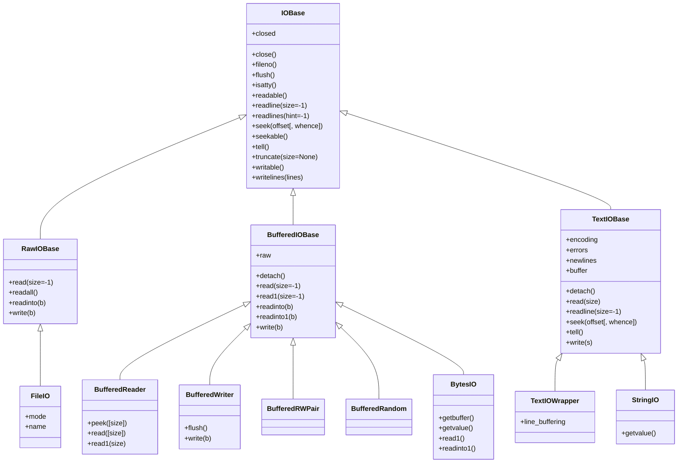

## 终端的输入输出

### input

Python 提供了一个 `input` 函数供终端的输入使用，当程序执行到 `input` 处时会暂停并等待用户输入，用户输入完成并敲击回车后才会继续执行后续的代码。`input` 的返回值就是读取到的用户输入内容，还可以在调用 `input` 时传入一个字符串参数作为等待输入的提示信息显示。

```python
## 用 var 保存用户输入内容
>>> var = input()
'hello, world'
>>> var
'hello, world'
>>> 

## 等待输入时显示提示信息
>>> name = input('Please input your name:')
Please input your name:'tom'
>>> name
'tom'
>>> 
```

### print

Python 提供一个 `print` 函数，可用于向终端打印内容，`print` 函数的定义如下：

```python
print(*objects, sep=' ', end='\n', file=sys.stdout, flush=False)
```

根据定义：`print` 会把任意多个 `object` 使用 `str()` 方法转换为字符串，并且在多个 object 之间使用 `sep` 进行分割，并且在最后增加 `end`，`sep` 和 `end` 必须是字符串，然后将这些内容输出到 `file` 参数所指定的对象，`file` 参数指定的对象必须要有 `write(string)` 方法，默认 file 参数为 `sys.stdout`，即当前终端。

```python
## 向终端输出两个字符 a 和 b
>>> print('a', 'b')
a b
## 向终端输出 a 和 b，并且将 a 和 b 使用 - 进行分割
>>> print('a', 'b', sep='-')
a-b
## 向终端输出 a 和 b，并且在最后输出两个换行(\n)
>>> print('a', 'b', end='\n\n')
a b

>>>
```

需要注意的是 print 函数的 `sep`、`end`、`file` 和 `flush` 参数必须使用关键字参数的方式传入(即使用 name=value 的形式)，否则会被当作待打印的 `object` 对象。

## 文件的输入输出

文件的输入输出即为文件的读写，Python 中文件的读写分别使用 `read` 和 `write` 函数，但是在进行文件读写前必须使用 `open` 函数打开文件。

### open

`open` 函数定义如下：

```python
open(file, mode='r', buffering=-1, encoding=None, errors=None, newline=None, closefd=True, opener=None)
```

下面分别对其各参数进行说明：

- file

    可以是表示 `文件路径`（相对路径或绝对路径）的字符串（`string`）或者字节类型（`bytes`）。  
    也可以是表示 `文件描述符` 的数字（`Integer`），如果是文件描述符，那么默认情况下当 open 返回的文件对象被关闭时，文件描述符也会同时被关闭，除非调用 open 时传入 `closefd` 参数为 `False`。

- mode

    由固定的字符组成的表示文件打开模式的字符串，所有可选字符模式如下：

    | 字符 | 含义 |
    | ---- | ---- |
    | r | 读模式 |
    | w | 写模式，如果文件已存在则清空文件内容 |
    | x | 写模式，如果文件已存在则报错 |
    | a | 追加写模式，如果文件已存在则从文件末尾开始写入 |
    | b | 二进制模式 |
    | t | 文本模式 |
    | + | 更新模式（可读可写）  |

    以上字符又可以按照如下规则进行组合：

    ```
    (r|w|x|a)[b|t][+]  

    共 3 部分组成，圆括号表示必选参数，方括号表示可选参数
    第一部分为必选参数，从 r、w、x、a 中任选一个
    第二部分为可选参数，从 b 和 t 中任选一个，默认为 t
    第三部分也为可选参数，只有一个可选项 +
    ```

    根据组合规则，最终完整的模式及含义如下：

    | 模式 | 含义 | 
    | ---- | ---- |
    | r | 只读模式，进行写操作会报错 |
    | w | 只写模式，如果文件不存在则创建新文件，如果已存在则清空文件内容，进行读操作会报错 |
    | x | 只写模式，如果文件不存在则创建新文件，如果已存在则报错，进行读操作会报错 |
    | a | 追加写模式，如果文件不存在则创建新文件，如果已存在则从文件末尾开始写 |
    | r+ | 读写模式，相当于对 r 模式增加了写操作 |
    | w+ | 读写模式，相当于对 w 模式增加了读操作 |
    | x+ | 读写模式，相当于对 x 模式增加了读操作 |
    | a+ | 读写模式，相当于对 a 模式增加了读操作 |
    | rb | 与 r 模式相比，不同点在于以二进制模式打开文件 |
    | wb | 与 w 模式相比，不同点在于以二进制模式打开文件 |
    | xb | 与 x 模式相比，不同点在于以二进制模式打开文件 |
    | ab | 与 a 模式相比，不同点在于以二进制模式打开文件 |
    | rb+ | 与 r+ 模式相比，不同点在于以二进制模式打开文件 |
    | wb+ | 与 w+ 模式相比，不同点在于以二进制模式打开文件 |
    | xb+ | 与 x+ 模式相比，不同点在于以二进制模式打开文件 |
    | ab+ | 与 a+ 模式相比，不同点在于以二进制模式打开文件 |
    | rt | 与 r 模式相同 |
    | wt | 与 w 模式相同 |
    | xt | 与 x 模式相同 |
    | at | 与 a 模式相同 |
    | rt+ | 与 r+ 模式相同 |
    | wt+ | 与 w+ 模式相同 |
    | xt+ | 与 x+ 模式相同 |
    | at+ | 与 a+ 模式相同 |

- buffering

    缓存策略，可选值即含义如下：

    | 值 | 含义 |
    | -- | ---- |
    | -1 | `二进制模式`: 自动检测存储设备的块大小（即 io.DEFAULT_BUFFER_SIZE，通常是 4096 或 8192，单位字节），并以此作为缓存大小。<br> `交互式文本模式`: 即 isatty() 为 True 的文件对象，该情况下将缓存 `一行`。 <br> `其他文本模式`: 与二进制模式相同。 |
    | 0 | 不使用缓存，`仅适用于二进制模式` |
    | 1 | 缓存 `一行`，`仅适用于文本模式` |
    | >1 | 以该值（单位字节）作为固定大小进行缓存 |

- encoding

    文件编码和解码格式，`仅适用于文本模式`，完整的可选编码格式列表见 [standard-encodings](https://docs.python.org/3.5/library/codecs.html#standard-encodings)

- errors

    当编码或者解码文件内容出现错误时的处理方式，`仅适用于文本模式`，常用的处理方式如下

    | 值 | 含义 |
    | ---- | ---- |
    | strict | 当出现编码错误时报 `ValueError`，默认值 |
    | ignore | 忽略错误 |

    完整的处理方式见 [error-handlers](https://docs.python.org/3.5/library/codecs.html#error-handlers)

- newline

    该参数控制读和写的换行符，`仅适用于文本模式`，可选值及其作用如下：

    | 值 | 读操作时 | 写操作时 |
    | -- | -------- | -------- |
    | None | '\n'、'\r' 和 '\r\n' 都会被当作换行符，并且统一转换为 '\n' | '\n' 会被转换为当前系统默认换行符，即 `os.linesep` |
    | '' | '\n'、'\r' 和 '\r\n' 都会被当作换行符，但是均保持原样，不做转换 | 对换行符保持原样，不做转换 |
    | '\n' | 只有 '\n' 会被当作换行符，但是不会做转换 | 对换行符保持原样，不做转换 |
    | '\r' | 只有 '\r' 会被当作换行符，但是不会做转换 | '\n' 会被转换为 '\r' |
    | '\r\n' | 只有 '\r\n' 会被当作换行符，但是不会做转换 | '\n' 会被转换为 '\r\n' |

### io

`open` 方法返回的所有对象都定义在 `io` 模块中，其类图如下：



`open` 方法在不同模式和缓存策略下返回的文件对象类型如下：

| 模式 | buffering == 0 | buffering != 0 |
| ---- | ---- | -------- |
| r | N/A | TextIOWrapper |
| w | N/A | TextIOWrapper |
| x | N/A | TextIOWrapper |
| a | N/A | TextIOWrapper |
| r+ | N/A | TextIOWrapper |
| w+ | N/A | TextIOWrapper |
| x+ | N/A | TextIOWrapper |
| a+ | N/A | TextIOWrapper |
| rb | FileIO | BufferedReader |
| wb | FileIO | BufferedWriter |
| xb | FileIO | BufferedWriter |
| ab | FileIO | BufferedWriter |
| rb+ | FileIO | BufferedRandom |
| wb+ | FileIO | BufferedRandom |
| xb+ | FileIO | BufferedRandom |
| ab+ | FileIO | BufferedRandom |
| rt | 与 r 模式相同 | 与 r 模式相同 |
| wt | 与 w 模式相同 | 与 w 模式相同 |
| xt | 与 x 模式相同 | 与 x 模式相同 |
| at | 与 a 模式相同 | 与 a 模式相同 |
| rt+ | 与 r+ 模式相同 | 与 r+ 模式相同 |
| wt+ | 与 w+ 模式相同 | 与 w+ 模式相同 |
| xt+ | 与 x+ 模式相同 | 与 x+ 模式相同 |
| at+ | 与 a+ 模式相同 | 与 a+ 模式相同 |

### 文件读写示例

通常文件读写的流程是先使用 open() 打开文件，然后进行读写操作，最后使用 close() 方法关闭文件：

```python
>>> f = open('testfile', 'r+')
>>> f.read()
'hello'
>>> f.write('world')
5
>>> f.seek(0)
0
>>> f.read()
'helloworld'
>>> f.close()
```

但是更推荐的方法是使用 `with` 子句来进行文件读写操作，这样在 with 结束后会自动关闭文件，避免因忘记关闭而占用文件的情况：

```python
>>> data = ''
>>> with open('testfile') as f:
...     data = f.read()
...
>>> f.closed
True
>>> data
'hello'
```

## 引用资料

- [Input and Output] : https://docs.python.org/3.5/tutorial/inputoutput.html
- [input] : https://docs.python.org/3.5/library/functions.html#input
- [print] : https://docs.python.org/3.5/library/functions.html#print
- [open] : https://docs.python.org/3.5/library/functions.html#open
- [io] : https://docs.python.org/3.5/library/io.html#i-o-base-classes
